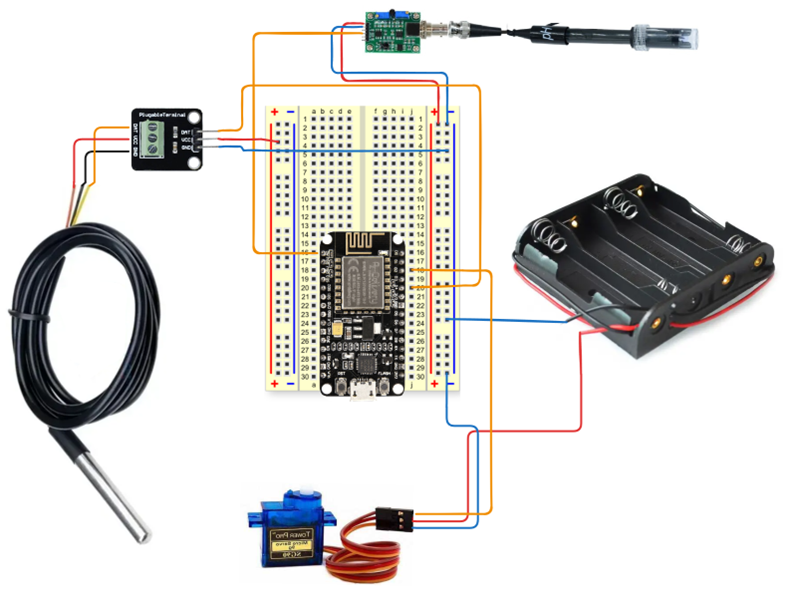

# Aquamonitor: Monitoring Air dan Pemberian Pakan Akuarium

[](LICENSE)  
[]()  

Aquamonitor adalah sistem IoT yang memantau suhu dan pH air akuarium serta mengotomatisasi pemberian pakan ikan. Proyek ini terdiri dari kode Arduino dan web berbasis Next.js, dengan Supabase sebagai backend.

---

## ✨ Fitur Utama

- Monitoring suhu air secara real-time  
- Monitoring pH air secara real-time  
- CRUD jadwal pemberian pakan  
- Otomatisasi pemberian pakan melalui servo

---

## 💻 Teknologi yang Digunakan

- **Frontend:** Next.js  
- **Backend:** Supabase  
- **Perangkat Keras:** Arduino Uno, ESP8266, Sensor DS18b20, Sensor PH402C, Servo Motor

---

## 🚀 Instalasi & Setup

### 1. Clone repository:
```bash
   git clone <repository-url>
   cd <repository-folder>
```
### 2. Install dependensi
```bash
    npm install
```
### 3. Siapkan Supabase
- Buat project baru 
- Buat tabel: 
    - `sensor`: `temp_data`, `ph_data` 
    - `feeder_schedule`: `time`, `volume` 
- Salin Anon Key dan URL Supabase ke file `.env`

### 4. Jalankan Next
```bash
    npm start
```

---

## 📂 Contoh .env
Buat file `.env`:
```ini
    NEXT_PUBLIC_SUPABASE_URL=https://your-supabase-url.supabase.co
    NEXT_PUBLIC_SUPABASE_KEY=your-anon-key
```

--- 

## 🔌 Upload Kode Arduino 
Pada folder arduino terdapat 2 file `.ino` bisa upload kodenya di mikrokontroler masing masing
1. Buka **Arduino IDE** 
2. Pilih **Board:** Arduino Uno 
3. Pilih **Port:** sesuai port yang terdeteksi 
4. Hubungkan board dengan kabel USB 
5. Buka file `.ino` dari folder Arduino 
6. Klik **Upload**”

## 📡 Skema Perkabelan (Disarankan)


## 📋 Tabel Hubungan Pin Perangkat Keras

| No | Perangkat Keras    | Pin       | Hubungan Pin                 |
|----|---------------------|-----------|------------------------------|
| 1  | Arduino Uno        | 5V        | Pin Breadboard Powerbus +    |
|    |                   | GND       | Pin Breadboard Powerbus -    |
|    |                   | 3.3V      | Pin EN ESP8266               |
|    |                   | RX        | Pin TX ESP8266               |
|    |                   | TX        | Pin RX ESP8266               |
|    |                   | 2        | Pin DATA DS18B20 Sensor      |
|    |                   | 3~       | Pin Signal PWM Motor Servo   |
| 2  | ESP8266 NodeMCU   | VIN       | Pin Breadboard Powerbus +    |
|    |                   | GND       | Pin Breadboard Powerbus -    |
|    |                   | RX        | Pin TX Arduino Uno           |
|    |                   | TX        | Pin RX Arduino Uno           |
|    |                   | EN        | Pin 3.3V Arduino Uno         |
| 3  | Sensor DS18B20    | VCC       | Pin Breadboard Powerbus +    |
|    |                   | GND       | Pin Breadboard Powerbus -    |
|    |                   | DATA      | Pin 2 Arduino Uno            |
| 4  | Motor Servo       | PWM       | Pin 3~ Arduino Uno           |
|    |                   | VCC       | Pin Breadboard Powerbus +    |
|    |                   | GND       | Pin Breadboard Powerbus -    |
| 5  | Sensor PH4502C    | VCC       | Pin Breadboard Powerbus +    |
|    |                   | GND       | Pin Breadboard Powerbus -    |
|    |                   | PHOUT     | Pin A0 Arduino Uno           |

---

